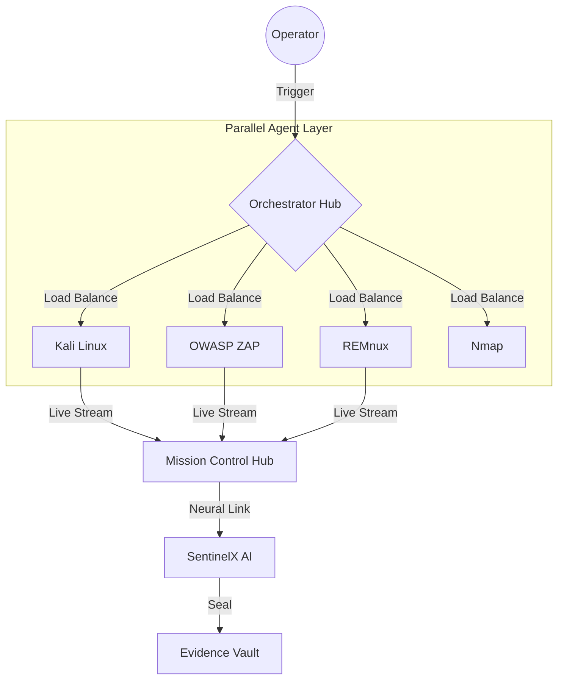

# RedRainbow: Master Architecture (Live Agent Probes)


````carousel

<!-- slide -->

<!-- slide -->


<!-- slide -->


<!-- slide -->


<!-- slide -->


<!-- slide -->

### 🛠️ Strategic Layer Breakdown

| Layer | Component | Functionality |
| :--- | :--- | :--- |
| **Tier 1** | Client Dashboard | Glassmorphism React UI for mission control and telemetry. |
| **Tier 2** | Orchestration Hub | Python-driven load balancer managing 11 concurrent agents. |
| **Tier 3** | Agent Mesh | Parallel forensic nodes (Kali, ZAP, REMnux) for 'Fast Action'. |

<!-- slide -->

### ⚡ Parallel Execution Model

*   **Load Balancing**: The Core distributes audit payloads across 11 isolated containers simultaneously.
*   **High-Speed Action**: Asynchronous task queuing ensures zero-lag telemetry streaming.
*   **Neural Synthesis**: Results from all layers are unified by SentinelX AI for the final report.

<!-- slide -->

### 📡 Big Flow Topology


````
